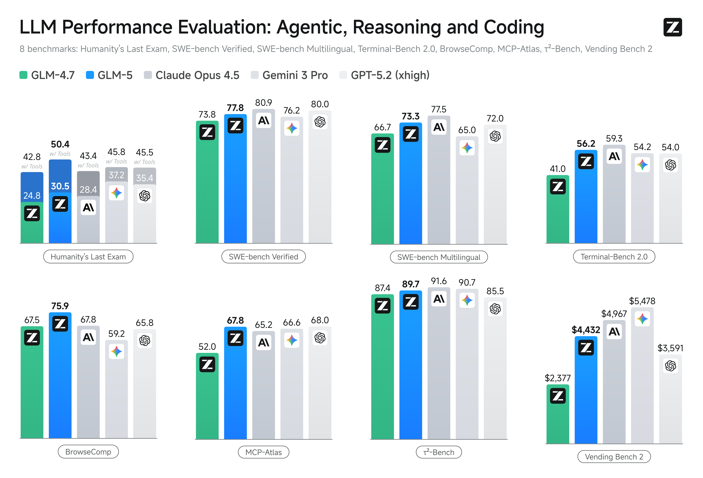
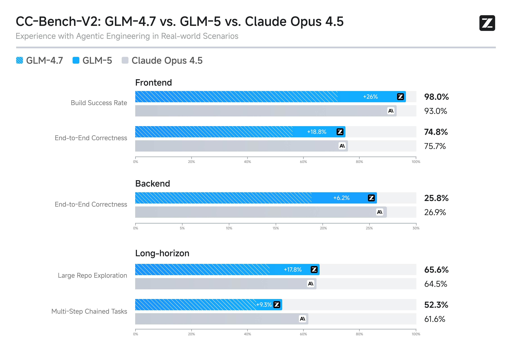
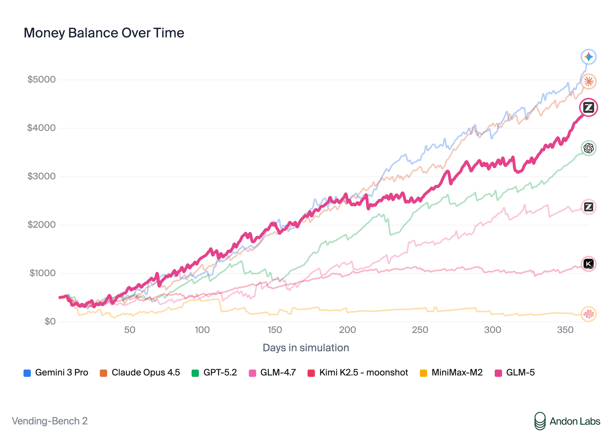

# GLM-5

<div align="center">

</div>
<p align="center">
    👋 Join our<a href="resources/WECHAT.md" target="_blank"> Wechat</a> or <a href="https://discord.gg/QR7SARHRxK" target="_blank">Discord</a> community.
    <br>
    📖 Check out the GLM-5 <a href="https://z.ai/blog/glm-5" target="_blank">technical blog</a>.
    <br>
    📍 Use GLM-5 API services on <a href="https://docs.z.ai/guides/llm/glm-5">Z.ai API Platform. </a>
    <br>
    👉 One click to <a href="https://chat.z.ai">GLM-5</a>.
</p>

## Introduction

We are launching GLM-5, targeting complex systems engineering and long-horizon agentic tasks. Scaling is still one of the most important ways to improve the intelligence efficiency of Artificial General Intelligence (AGI). Compared to GLM-4.5, GLM-5 scales from 355B parameters (32B active) to 744B parameters (40B active), and increases pre-training data from 23T to 28.5T tokens. GLM-5 also integrates DeepSeek Sparse Attention (DSA), largely reducing deployment cost while preserving long-context capacity.

Reinforcement learning aims to bridge the gap between competence and excellence in pre-trained models. However, deploying it at scale for LLMs is a challenge due to the RL training inefficiency. To this end, we developed [slime](https://github.com/THUDM/slime), a novel **asynchronous RL infrastructure** that substantially improves training throughput and efficiency, enabling more fine-grained post-training iterations. With advances in both pre-training and post-training, GLM-5 delivers significant improvement compared to GLM-4.7 across a wide range of academic benchmarks and achieves best-in-class performance among all open-source models in the world on reasoning, coding, and agentic tasks,  closing the gap with frontier models.



GLM-5 is purpose-built for complex systems engineering and long-horizon agentic tasks. On our internal evaluation suite CC-Bench-V2, GLM-5 significantly outperforms GLM-4.7 across frontend, backend, and long-horizon tasks, narrowing the gap to Claude Opus 4.5.



On [Vending Bench 2](https://andonlabs.com/evals/vending-bench-2), a benchmark that measures long-term operational capability, GLM-5 ranks \#1 among open-source models. Vending Bench 2 requires the model to run a simulated vending machine business over a one-year horizon; GLM-5 finishes with a final account balance of $4,432, approaching Claude Opus 4.5 and demonstrating strong long-term planning and resource management.



## Download Model

| Model     | Download Links                                                                                                                  | Model Size | Precision |
|-----------|---------------------------------------------------------------------------------------------------------------------------------|------------|-----------|
| GLM-5     | [🤗 Hugging Face](https://huggingface.co/zai-org/GLM-5)<br> [🤖 ModelScope](https://modelscope.cn/models/ZhipuAI/GLM-5)         | 744B-A40B  | BF16      |
| GLM-5-FP8 | [🤗 Hugging Face](https://huggingface.co/zai-org/GLM-5-FP8)<br> [🤖 ModelScope](https://modelscope.cn/models/ZhipuAI/GLM-5-FP8) | 744B-A40B  | FP8       |

## Serve GLM-5 Locally

### Prepare environment

vLLM, SGLang, and xLLM all support local deployment of GLM-5. A simple deployment guide is provided here.

+ vLLM

    Using Docker as:

    ```shell
    docker pull vllm/vllm-openai:nightly 
    ```

    or using pip:

    ```shell
    pip install -U vllm --pre --index-url https://pypi.org/simple --extra-index-url https://wheels.vllm.ai/nightly
    ```

    then upgrade transformers:

    ```
    pip install git+https://github.com/huggingface/transformers.git
    ```

+ SGLang

    Using Docker as:
  
  ```bash
    docker pull lmsysorg/sglang:glm5-hopper # For Hopper GPU
    docker pull lmsysorg/sglang:glm5-blackwell # For Blackwell GPU
    ```

### Deploy

+ vLLM

    ```shell
    vllm serve zai-org/GLM-5-FP8 \
         --tensor-parallel-size 8 \
         --gpu-memory-utilization 0.85 \
         --speculative-config.method mtp \
         --speculative-config.num_speculative_tokens 1 \
         --tool-call-parser glm47 \
         --reasoning-parser glm45 \
         --enable-auto-tool-choice \
         --served-model-name glm-5-fp8
    ```

    Check the [recipes](https://github.com/vllm-project/recipes/blob/main/GLM/GLM5.md) for more details.

+ SGLang

    ```shell
    python3 -m sglang.launch_server \
      --model-path zai-org/GLM-5-FP8 \
      --tp-size 8 \
      --tool-call-parser glm47  \
      --reasoning-parser glm45 \
      --speculative-algorithm EAGLE \
      --speculative-num-steps 3 \
      --speculative-eagle-topk 1 \
      --speculative-num-draft-tokens 4 \
      --mem-fraction-static 0.85 \
      --served-model-name glm-5-fp8
    ```
  
    Check the [sglang cookbook](https://cookbook.sglang.io/autoregressive/GLM/GLM-5) for more details.

+ xLLM and other Ascend NPU

    Please check the deployment guide [here](https://github.com/zai-org/GLM-5/blob/main/example/ascend.md).

## Citation

Our technical report is coming soon.
